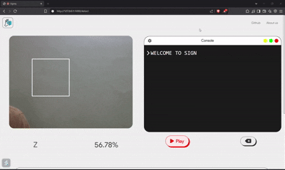
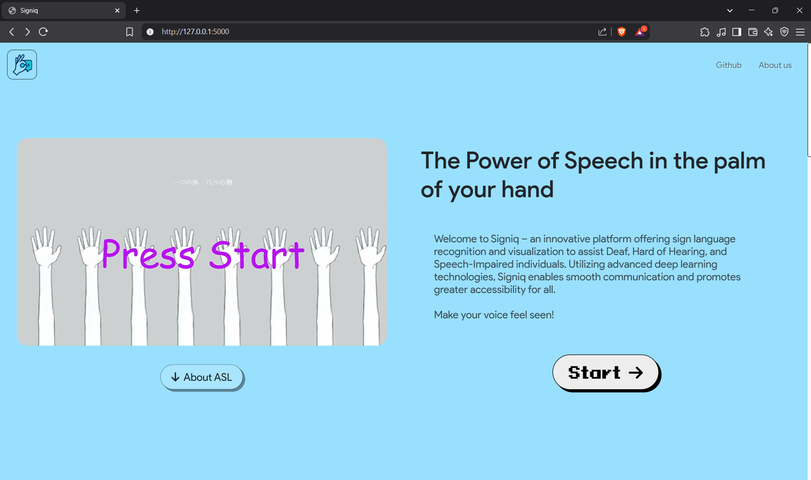
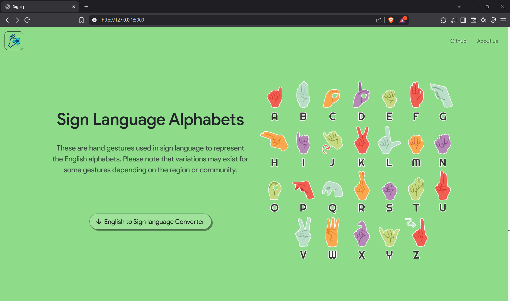
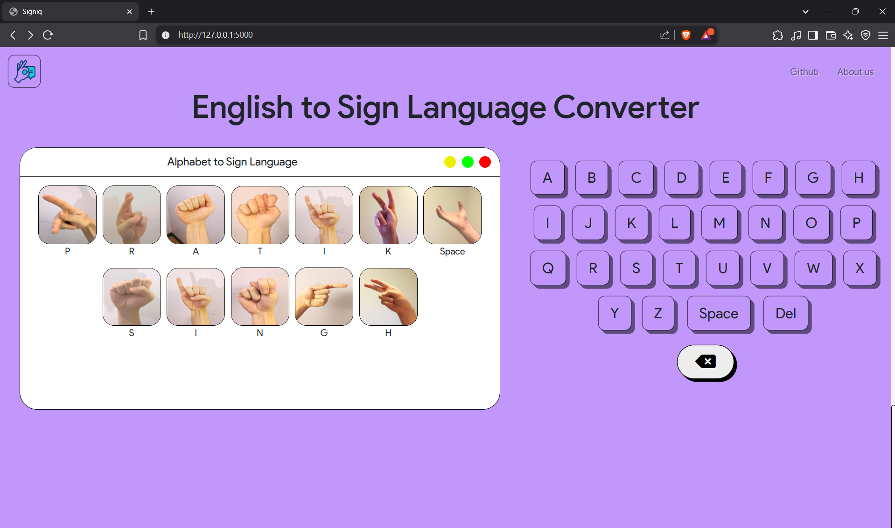
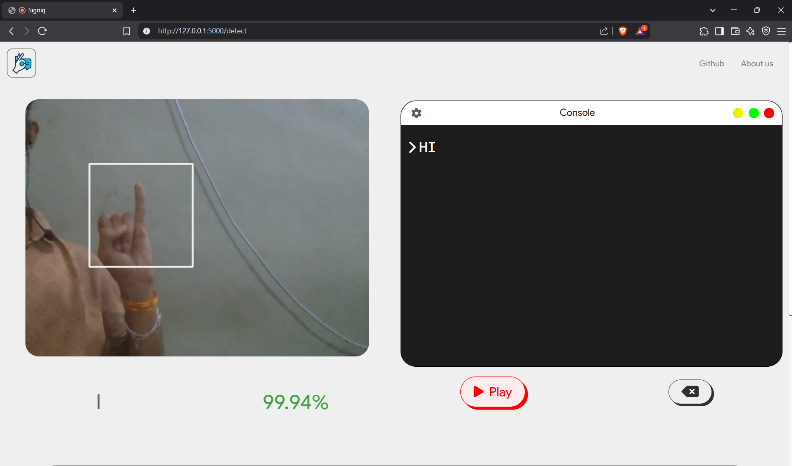
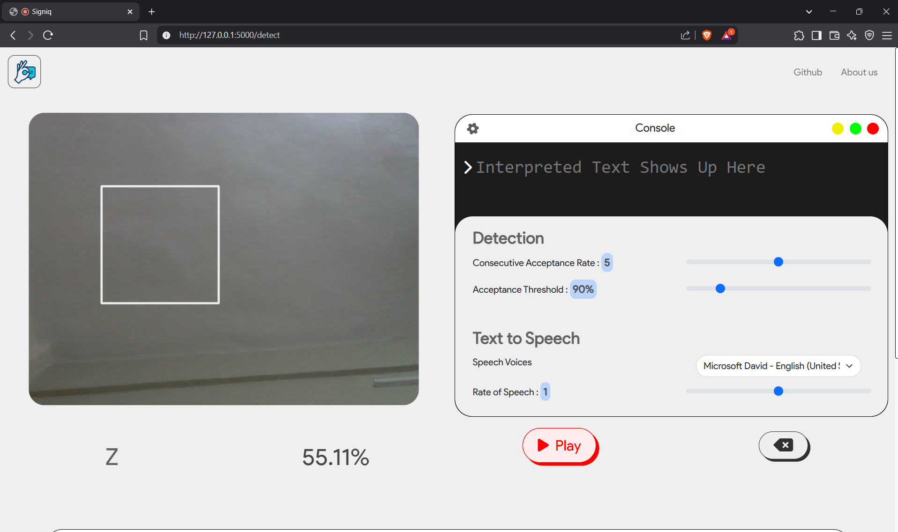
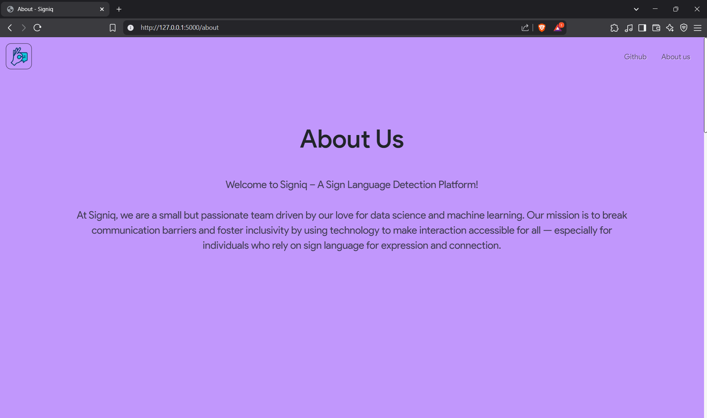
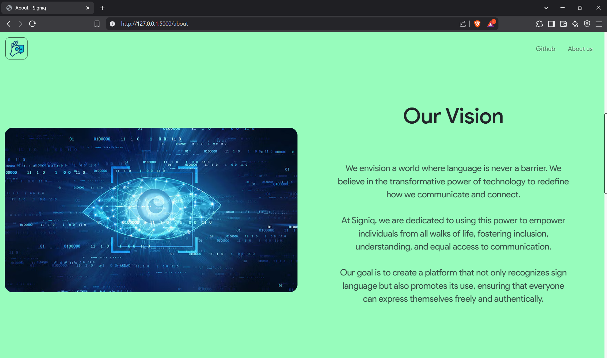
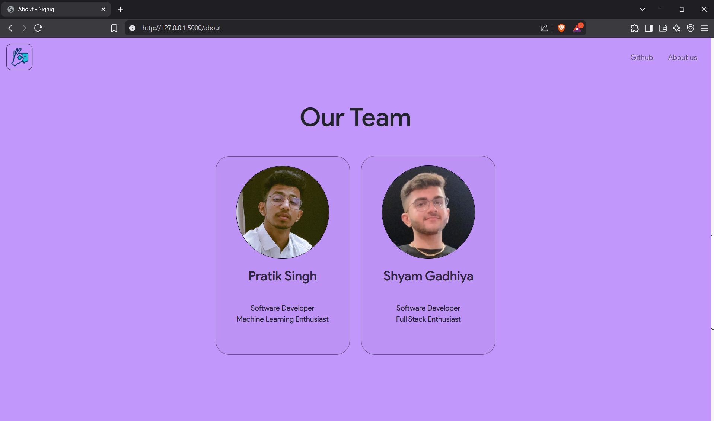
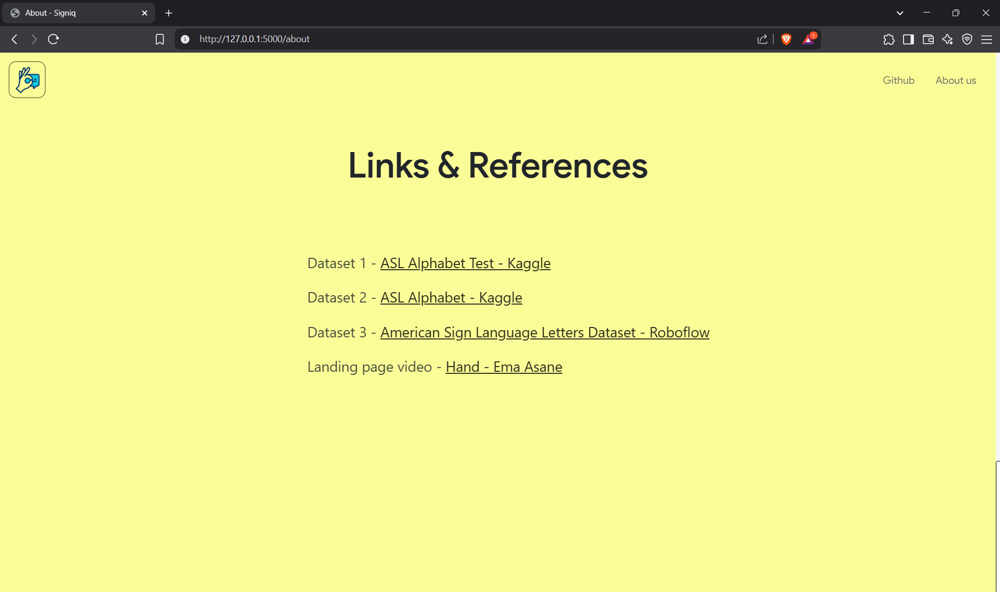

# Establish Two-Way Communication using MobileNet, TensorFlow v2, Python, Flask, OpenCV, and the Web Speech API


<!-- PROJECT LOGO -->
<br />
<div align="center">
    
    <h3 align="center">Signiq</h3>
    
    <p>This gif shows Sign detetcion and recognition of the class which is written as interpreted text.
    </p>
</div>


## Setup using Python virtual environment

First we create the virtual environment and clone the repository into it. 
Then, we install all dependencies before running the application.
Note:- Python 3.10.11
```sh
python -m venv myenv
cd /path/to/myenv
git clone https://github.com/flamekizer11 Signiq
source myenv/Scripts/activate
cd Signiq
python -m pip install -r requirements.txt
python app.py
```

## Usage

- Click on 'Start' on the homepage to begin sign language detection using your video feed.

- Make sure to grant permission for camera access when prompted.

- Perform hand gestures representing letters to form words or phrases, which will appear on the console to the right.

- Click the 'Play' button below the console to convert your text into speech for smooth communication.

- If you're unfamiliar with sign language symbols, refer to the "Gesture Guide" available on the homepage.

- Follow the 'Tips' section beneath the console for further assistance.


## Screenshots












## Features 

- This website was developed using Python, Flask, HTML, CSS & JavaScript.

Users who wish to communicate using sign language can utilize this detection system to convert recognized gestures into speech, enabling seamless interaction.
Users unfamiliar with sign language may use the English to Sign converter to learn the corresponding hand signs.
The voice used for Text-to-Speech (TTS) can be customized in the settings.
Developers can view the raw camera feed via SocketIO, alongside live gesture prediction rendered on the OpenCV stream.
Text-to-speech translation utilizes the SpeechSynthesisUtterance() interface from the Web Speech API.
TensorFlow 2.0 and the Keras library were employed to develop the detection model. The final model used for testing and deployment is MobileNet.

Additional machine learning strategies include

Data Augmentation
Transfer Learning
Validation Set for Accuracy Evaluation
Early Stopping
Nadam Optimizer
Exponential Decay Learning Rate
Categorical Cross-Entropy Loss


## File Structure

```
.
├── app.py.............................Runs the Flask application and deploys all webpages
│                                      as well as calls necessary computational functions
├── datasets...........................Contains tar.gz file of the dataset and 
│                                      some necessary statistics for the dataset
├── LICENSE............................MIT LICENSE
├── models.............................TFLITE version models of MobileNet and EfficientNet
│   ├── model_efficientnet_v2s.tflite
│   └── model_mobilenet_v2.tflite
├── README.md
├── requirements.txt
├── screenshots........................Contains necessary visualizations about the 
│                                      model performance, data and website
├── static.............................Contains all js, css files and images used in the website
│   ├── connection.js
│   ├── opencv.js
│   └── style.css
├── templates..........................Contains all HTML templates deployed in the website
│   ├── about.html
│   ├── index.html.....................HTML template of the page where sign detection occurs
│   ├── landing.html
│   └── layout.html
├── train.py...........................Used to train the entire model, contains all 
│                                      ML techniques mentioned above
├── webcam_detect.py...................Loads the model and predicts the class from the 
│                                      frame input given as softmax probability which is sent 
│                                      back to the client's end
└── webcam.py..........................Used for testing Sign Detection and preiction locally
```
